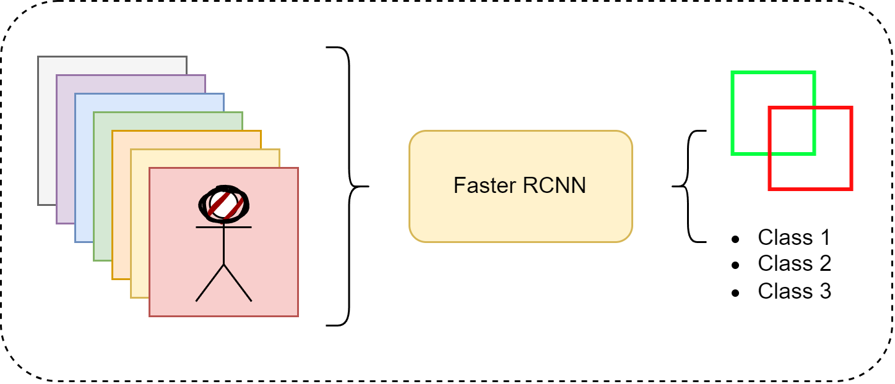

## Object detection in multi-spectral images using Faster RCNN and mmdetection (tutorial)


This guide explains the process of training a custom dataset with a modified backbone that accommodates non-standard input channels (e.g., 7 channels for multispectral images) using a pretrained model.





## Installation
Follow the installation guide for PyTorch and MMdetection [here](https://mmdetection.readthedocs.io/en/latest/get_started.html)

```bash
conda create --name mm_det_multispectral_test2 python=3.8 -y

#check CUDA version
nvcc --version

# CUDA 11.7
conda install pytorch==2.0.1 torchvision==0.15.2 torchaudio==2.0.2 pytorch-cuda=11.7 -c pytorch -c nvidia
```


We recommend that users follow our best practices to install MMDetection. However, the whole process is highly customizable. See Customize Installation section for more information.

### Best Practices
- Step 0. Install MMEngine and MMCV using MIM.

```bash
pip install -U openmim
mim install mmengine
mim install "mmcv>=2.0.0"
```

Note: In MMCV-v2.x, mmcv-full is rename to mmcv, if you want to install mmcv without CUDA ops, you can use mim install "mmcv-lite>=2.0.0rc1" to install the lite version.

### Step 1. Install MMDetection.

**Case a:** If you develop and run mmdet directly, install it from source:
```bash
git clone https://github.com/open-mmlab/mmdetection.git
cd mmdetection
pip install -v -e .
# "-v" means verbose, or more output
# "-e" means installing a project in editable mode,
# thus any local modifications made to the code will take effect without reinstallation.
```

**Case b:** If you use mmdet as a dependency or third-party package, install it with MIM:
```bash
mim install mmdet
### Verify the installation
```

### Verification

To verify whether MMDetection is installed correctly, we provide some sample codes to run an inference demo.

- Step 1. We need to download config and checkpoint files.

```bash
mim download mmdet --config rtmdet_tiny_8xb32-300e_coco --dest .
```

The downloading will take several seconds or more, depending on your network environment.
When it is done, you will find two files `rtmdet_tiny_8xb32-300e_coco.py and rtmdet_tiny_8xb32-300e_coco_20220902_112414-78e30dcc.pth` in your current folder.

- Step 2. Verify the inference demo.

**Case a:** If you install MMDetection from source, just run the following command.

```bash
python demo/image_demo.py demo/demo.jpg rtmdet_tiny_8xb32-300e_coco.py --weights rtmdet_tiny_8xb32-300e_coco_20220902_112414-78e30dcc.pth --device cpu
```


---
## Run

For training, and inference, you can use the following commands, for training:

```bash
python train.py
```
or for inference:
```bash
# test
python eval.py
```

---


## Checklist for Real Dataset

### Dataset Preparation
- Replace the synthetic dataset with your real data.
- Ensure the dataset provides:
  - 7-channel image tensors.
  - Corresponding annotations (bounding boxes and labels).

### Annotation Format
- Each annotation must be a dictionary with:
  - `boxes`: Tensor of shape `[num_objects, 4]` with `[x_min, y_min, x_max, y_max]`.
  - `labels`: Tensor of shape `[num_objects]` with class indices.

### Normalize Input Statistics
- Adjust `image_mean` and `image_std` in `CustomTransform` to match the statistics of your dataset.

### Classes in Dataset
- Ensure the `num_classes` parameter in `FasterRCNN` matches the number of classes in your dataset (including background class).

### Training Hyperparameters
- Fine-tune learning rate, batch size, and number of epochs based on your dataset size and complexity.

---

## Limitations to Address (to-do)

### Performance on 7-Channel Images
- Pretrained weights for the additional 4 channels are initialized randomly, which could impact performance.
- If possible, pretrain the backbone on a related 7-channel dataset or augment the training dataset to improve generalization.

### Data Augmentation
- Include data augmentation techniques tailored to your dataset, especially if it's small, to improve robustness.

### Evaluation Metrics
- Implement metrics like mAP (mean Average Precision) to evaluate the model’s performance during and after training.

---
### References:
- mmdetection [docs](https://mmdetection.readthedocs.io/en/latest/get_started.html).
- [issue](https://github.com/open-mmlab/mmdetection/issues/7334) and [discussion](https://github.com/open-mmlab/mmdetection/discussions/8976).


